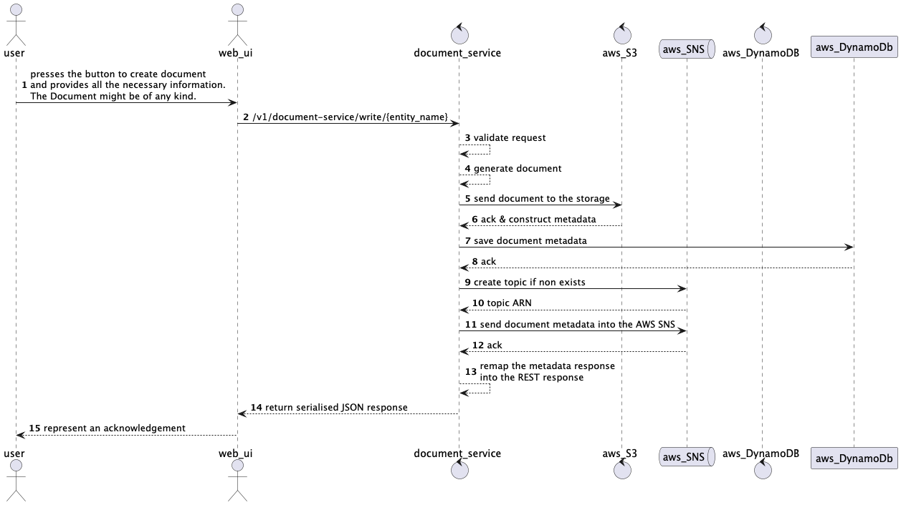

# Document Service

Let's imagine that the following service is a subset of the SOA platform that serves some business purpose let it be
insurance platform that generates some related documents.

## Functional requirements

* The following service has to generate these PDF documents:
    * Policy
    * Claim
    * Invoice
* All the documents have to be stored as both metadata and actual documents generated PDF in some storage (an
  Implementation shall allow switching from, for example, AWS S3 to SFTP. Also, assume that each
  document might be saved in a different storage)
* The same service is generating PDF documents
* There has to be a capability to download these documents as necessary from the storage
* Document metadata has to be saved in some storage
* The notification upon generation of each document has to be sent to some notification system (AWS SNS in this case)
* Each document has to contain the following set of fields:
    * Policy
        * Name of Insured
        * Name of the Owner
        * Policy number
        * Phone number
        * Address
        * City
        * Date of Birth
        * Relationship to Insured
        * Premium
        * LOB (Line of business)
    * Claim
        * Address
        * City
        * Policy number
        * Claim number
        * Place of incident
        * Short description
    * Invoice
        * Policy Number
          Name of Insured
        * Name of the Owner
        * Phone number
        * Total Price

## Non-functional requirements

* An AWS Cloud and its services will be used
* An app has to handle around 2-6 requests per second for both read and write
* An event of every operation shall be accessible in a messaging broker (AWS SNS)
* Document format - PDF - assume that in the future there might be different document formats as well
* Documents have to be stored in the AWS S3 bucket - assume that potentially in the future some of the entities might be
  stored in SFTP for example
* Document metadata will be store in a key-value NoSQL datastore AWS DynamoDB
* Notification (an event) on each operation (validate, generate, sendToStorage and save) have to be sent into the SNS (
  note that it has to be sent only after the full document lifecycle has complete)

## High-level design



## Build and run
An application could be run from both an IDE from the JAR archive or in a Docker container.

### An option from IDE
Fro that purpose add the following VM options into the application run settings:

```text
-DACCESS_KEY=your_access_key
-DSECRET_KEY=your_secret
-DREGION=eu-north-1
-DDYNAMODB_ENDPOINT=https://dynamodb.eu-north-1.amazonaws.com
-DS3_ENDPOINT=https://s3.eu-north-1.amazonaws.com
-DSNS_ENDPOINT=https://sns.eu-north-1.amazonaws.com
```

Where your_access_key and your_secret would be your access and secret keys. You can also change the region so as
endpoint for each AWS service in each region.

### As a standalone JAR

Execute the following commands:
```shell
mvn clean package
java \
    -DACCESS_KEY=your_access_key \
    -DSECRET_KEY=your_secret \
    -DREGION=eu-north-1 \
    -DDYNAMODB_ENDPOINT=https://dynamodb.eu-north-1.amazonaws.com \
    -DS3_ENDPOINT=https://s3.eu-north-1.amazonaws.com \
    -DSNS_ENDPOINT=https://sns.eu-north-1.amazonaws.com \
    -jar /usr/lib/contexts/document-service.jar
```

Where your_access_key and your_secret would be your access and secret keys. You can also change the region so as
endpoint for each AWS service in each region.

### As a Docker container

Execute the following commands:
```shell
mvn clean package
```shell
cd ./document-service
docker build . -t document-service
docker run -e ACCESS_KEY=your_access_key -e SECRET_KEY=your_secret -e REGION=eu-north-1 -e DYNAMODB_ENDPOINT=https://dynamodb.eu-north-1.amazonaws.com -e S3_ENDPOINT=https://s3.eu-north-1.amazonaws.com -e SNS_ENDPOINT=https://sns.eu-north-1.amazonaws.com -p 8080:8080 document-service
```

Where your_access_key and your_secret would be your access and secret keys. You can also change the region so as
endpoint for each AWS service in each region.
