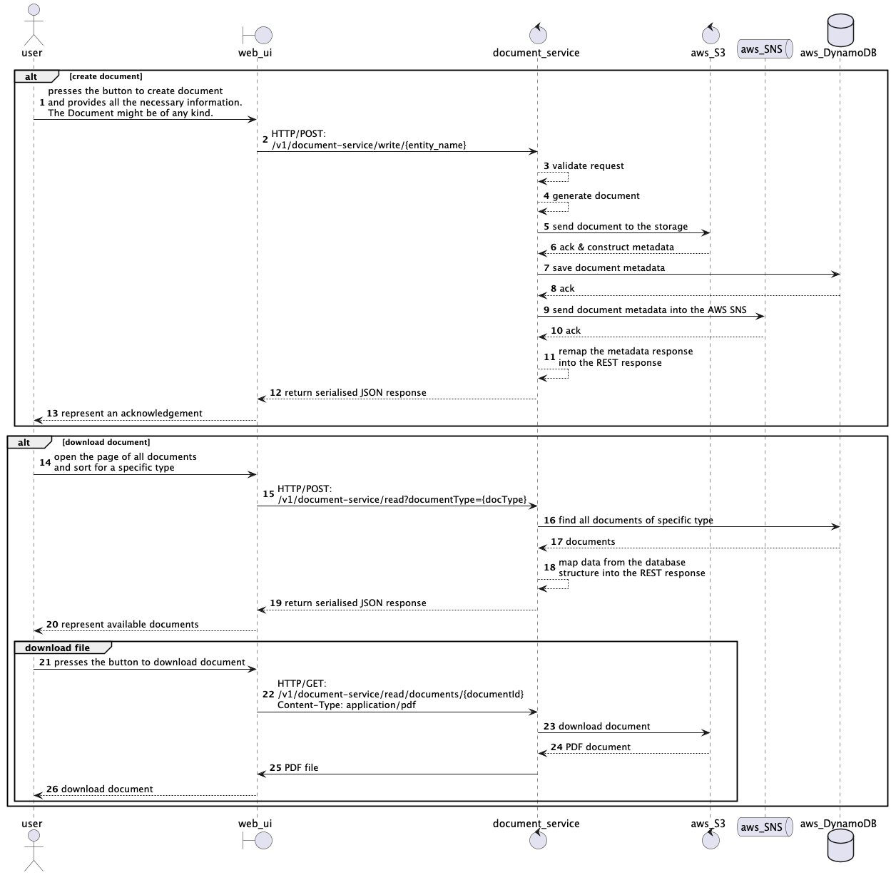

# Document Service

Let's imagine that the following service is a subset of the SOA platform that serves some business purpose let it be
insurance platform that generates some related documents.

Functional requirements:

* The following service has to generate the following PDF documents:
    * Policy
    * Claim
    * Invoice
* All the documents have to be stored as both metadata and actual documents generated PDF in some storage (Let's say an
  AWS S3 bucket)
* PDFs themselves are being generated by the third party system (let it be some mock for the sake of simplicity)
* There has to be a capability to download these documents upo necessity from the storage
* An event upon generation of each event has to be published into the Service Bus (Kafka Streaming in this case) to be
  eventually consistent

Non-functional requirements:

* Due to the overall system and its underlying UI constraints that one queries documents more frequently than
  makes these.
* CQRS pattern has to be leveraged to separate reads from writes and allow concurrent executions
  as well as independent scalability.
* Document write service will:
    * Save the document metadata into the write master database
    * Invoke an external document generation engine and generate PDF documents
    * Place the aforementioned documents into the AWS S3 bucket
* Document read service will:
    * Retrieve PDF from the AWS S3 bucket and return upon invocation of the underlying endpoint with
      the `Content-type: application/pdf` header (assuming the UI has to allow capability to download the PDF from the
      S3 bucket)
    * Have a capability to retrieve only a metadata of the underlying document (separate endpoint) by its ID - assuming
      concurrent UI which has to popup metadata for the underlying table.
    * Will read document metadata from the same database (no read replica is needed)
* Both applications `read` and `write` have to be deployed Docker containerised and deployed as K8S PODs into the AWS
  EKS cluster

## High level design
